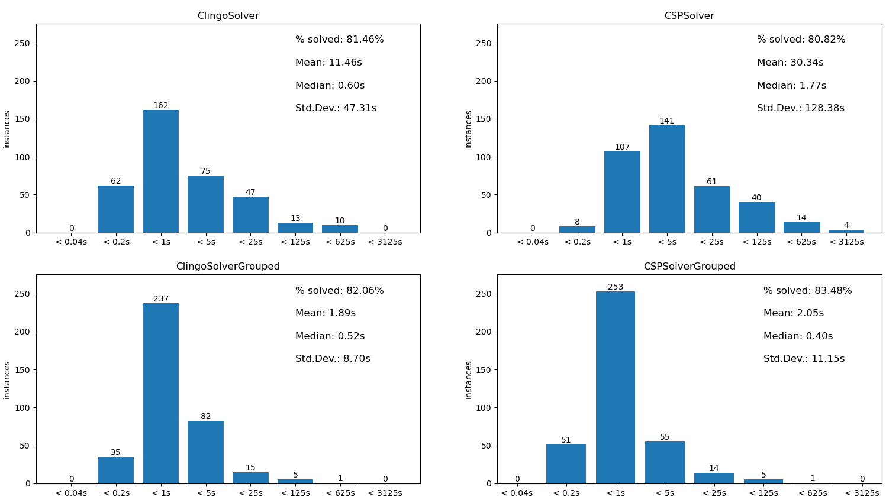

# Minesweeper Agents

This projects implementes two different approaches to solving the game of minesweeper, using Answer Set Programming and a constraint satisfaction problem (CSP) solver.

## Requirements
- Current version of Python3 (I used Python 3.10)
- The package manager [pip](https://pip.pypa.io/en/stable/)

Use pip to install the two dependencies [clingo](https://pypi.org/project/clingo/) and [CPMpy](https://pypi.org/project/cpmpy/):

```bash
pip install clingo cpmpy
```

## Installation

Either [download the source](https://github.com/fischly/minesweeper-agent/archive/refs/heads/main.zip) directly from Github and extract it or clone the project using git:
```sh
git clone https://github.com/fischly/minesweeper-agent.git
```

## Usage

Change to the project's directory:
```bash
cd minesweeper-agent
```

Start the solver with default parameters (30x16 field, 99 mines, clingo-grouped as solver and random seed):
```bash
python3 solver.py
```

Print the help message:

```bash
python3 solver.py --help
```
shows description of all usable parameters:

```bash
Usage: python3 solver.py [-h] [-w WIDTH] [-he HEIGHT] [-b BOMBS] [-s SEED] [--solver [{clingo,clingo-grouped,csp,csp-grouped}]] [--no-trivial] [-d DELAY] [-i]

Solves a randomly generated minesweeper instance

options:
  -h, --help            show this help message and exit
  -w WIDTH, --width WIDTH
                        The width of the minesweeper instance
  -he HEIGHT, --height HEIGHT
                        The height of the minesweeper instance
  -b BOMBS, --bombs BOMBS
                        The number of bombs of the minesweeper instance
  -s SEED, --seed SEED  Fixes the seed to generate the random minesweeper instance
  --solver [{clingo,clingo-grouped,csp,csp-grouped}]
                        The solving approach to use
  --no-trivial          If set, do not perform trivial cell opening/marking
  -d DELAY, --delay DELAY
                        Delay in milliseconds between performing actions
  -i, --interactive     If set, waits for user input between each action
```

## Benchmark
To benchmark the application by yourself, you can call
```bash
python3 benchmark/benchmark.py 
```
> Note: must be called while being in the  `minesweeper-agent` directory.

This will keep generating random seeds and try to solve Minesweeper instances with the given seed with every one of the four solvers implemented. Statistics (time taken, steps done, percentage done, game won) will be written in the file `benchmark/bench.log` and can be interpreted by calling:

> Note: this also needs the dependency [matplotlib](https://pypi.org/project/matplotlib/). Install it with the command `pip install matplotlib`.

```bash
python3 benchmark/benchmark_interpret.py
```

This will write two files, `solver-comparison.png` and `solver-comparison.pdf` into the `figures` directory, displaying a bar chart looking like this:




## License

[MIT](https://choosealicense.com/licenses/mit/)